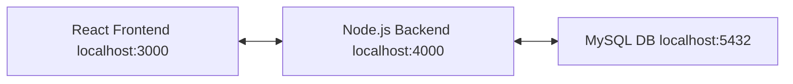

# ToDo Take-home Assessment

## System Architecture

## Tech stack

- Frontend: React
- Backend: Node.js + Express
- Database: MySQL (docker version)
- Containerization: Docker / docker-compose

## Requirements

- Docker and docker-compose installed

## Quick start (development)

1. `git clone [repo](https://github.com/shantosh-m/ToDo-App.git)`
2. `cd <repo>`
3. `docker-compose up --build`
4. Open `http://localhost:3000` (frontend). API at `http://localhost:4000/api/tasks`

## Project structure

- /backend
- /frontend
- docker-compose.yml

## Running tests

- Backend unit/integration: `cd backend && npm test`
- Frontend tests: `cd frontend && npm test`
- Postman API testing done 

## Notes

- Only most recent 5 incomplete tasks are shown.
- Completed tasks animate and are removed from the UI.
- And those records will be deleted entirely from the database.
